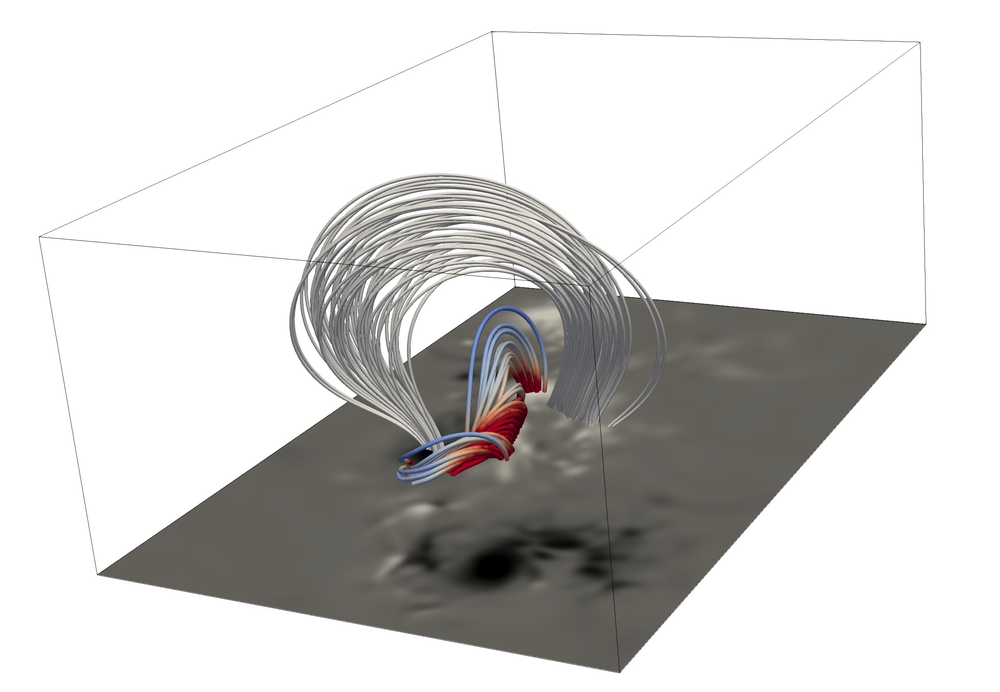

# Neural Network Force-Free magnetic field extrapolation - NF2


# [Usage](#usage) --- [Paper](#paper) --- [Data](#data)

[](https://colab.research.google.com/github/RobertJaro/NF2/blob/main/example/extrapolation.ipynb)


## Abstract

While the photospheric magnetic field of our Sun is routinely measured, its extent into the upper atmosphere remains elusive.
We present a novel approach for coronal magnetic field extrapolation, using a neural network that integrates observational data and the physical force-free magnetic field model. 
Our method flexibly finds a trade-off between the observation and force-free magnetic field assumption, improving the understanding of the connection between the observation and the underlying physics.
We utilize meta-learning concepts to simulate the evolution of active region NOAA 11158. Our simulation of 5 days of observations at full cadence, requires less than 13 hours of total computation time, enabling real-time force-free magnetic field extrapolations. 
A systematic comparison of the time evolution of free magnetic energy and magnetic helicity in the coronal volume, as well as comparison to EUV observations demonstrates the validity of our approach. The obtained temporal and spatial depletion of free magnetic energy unambiguously relates to the observed flare activity.

## Usage

NF2 can be used as framework to download SHARP data, perform extrapolations and to verify the results. 
The colab notebook provides a basic example that can be adjusted for arbitrary active regions.

### Custom use

Before you start download and install the requirements.txt in your Python3 environment.
Make sure that PyTorch is properly installed if you use a GPU environment.

```
git clone https://github.com/RobertJaro/NF2  # clone
cd NF2
pip install -r requirements.txt  # install
```

In the config file you have to specify the path to your data. You need the three vector components (Bp, Br, Bt) and their corresponding errors.
The base path defines where the results and the trained model are stored. The bin defines spatial reduction of the input data (bin 2 is recommended for SHARP data).
Other parameters are used for model training and can be set to their default value.

Example for SHARP 377 (config_377.json):
```json
{
  "data_path": [
    "/<<your path>>/hmi.sharp_cea_720s.377.20110215_000000_TAI.Bp.fits",
    "/<<your path>>/hmi.sharp_cea_720s.377.20110215_000000_TAI.Bp_err.fits",
    "/<<your path>>/hmi.sharp_cea_720s.377.20110215_000000_TAI.Br.fits",
    "/<<your path>>/hmi.sharp_cea_720s.377.20110215_000000_TAI.Br_err.fits",
    "/<<your path>>/hmi.sharp_cea_720s.377.20110215_000000_TAI.Bt.fits",
    "/<<your path>>/hmi.sharp_cea_720s.377.20110215_000000_TAI.Bt_err.fits"
  ],
  "base_path": "runs/ar_377",
  "bin": 2,

  "dim": 256,
  "lambda_div": 1e-1,
  "lambda_ff": 1e-1,
  "potential": true,
  "epochs": 800,
  "decay_epochs": 500,
  "batch_size": 10000,
  "log_interval": 100,
  "validation_interval": 100,
  "num_workers": 16
}
```

Training requires about 2 hours on a single V100 GPU.

```
python -m nf2.ar_extrapolation --config <<your path>>/config_377.json
```

For the extrapolations of time series we can use the model weights of the previous time step. A single time step can then be performed in a few minutes.
For this we also create a configuration that specifies our data.

Example for the time series of SHARP 377 (config_series_377.json):
```json
{
  "data_path": "/<<your path>>/ar_377_series",
  "base_path": "runs/series_ar_377",
  "meta_path": "runs/ar_377/final.pt",
  "bin": 2,
  
  "dim": 256,
  "lambda_div": 1e-1,
  "lambda_ff": 1e-1,
  "potential": true,
  "epochs": 2,
  "batch_size": 1e4,
  "n_samples_epoch": 1e7,
  "log_interval": 1,
  "validation_interval": 100,
  "num_workers": 16
}
```


``` 
python -m nf2.series_extrapolation --config <<your path>>/config_series_377.json
```

### Visualization

We recommend the use of Paraview for visualizing the results.
https://www.paraview.org/download/ 



NF2 models can be converted to VTK files that can be used by Paraview.

``` 
python -m nf2.evaluation.vtk <<path to your nf2 file>> <<path to the output vtk file>>
```

## Paper

under review at Nature Astronomy (Jarolim et al. 2022)

Preprint available: https://doi.org/10.21203/rs.3.rs-1415262/v1

## Data
All our simulation results are publicly available (parameter variation, time series, 66 individual active regions).

http://kanzelhohe.uni-graz.at/nf2/


