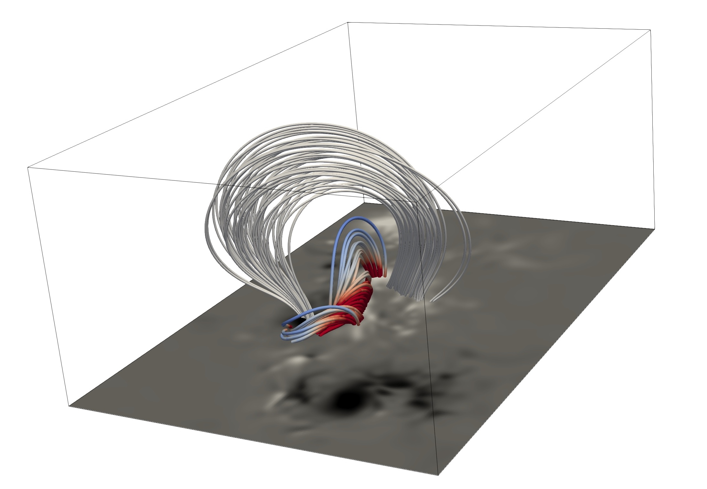

# Neural Network Force-Free Magnetic Field Extrapolation - NF2

[](https://nf2.readthedocs.io/en/latest/?badge=latest)
[](https://pypi.org/project/nf2/)
[](https://www.python.org/)
[](LICENSE)


---

[](#quick-start)
[](https://colab.research.google.com/github/RobertJaro/NF2/blob/main/examples/notebooks/colab_sharp_cea.ipynb)
[](https://colab.research.google.com/github/RobertJaro/NF2/blob/main/examples/notebooks/sharp_cea_cartesian.ipynb)
[](https://colab.research.google.com/github/RobertJaro/NF2/blob/main/examples/notebooks/spherical_hmi.ipynb)

NF2 is a Python framework for neural non-linear force-free magnetic-field extrapolations. It supports Cartesian and spherical geometries, single-boundary and multi-height observations, extrapolation series, standard NLFF quality metrics, and exports for scientific analysis and visualization.

The framework is designed for solar-physics analyses with HMI/SHARP, full-disk, synoptic, and benchmark data, while keeping the training, export, and evaluation interfaces consistent across geometries.

## Installation

NF2 supports Python 3.11 and 3.12.

Install from PyPI:

```bash
pip install nf2
```

Install with conda:

```bash
conda install nf2
```

For GPU-enabled PyTorch installs, select your CUDA version at [pytorch.org/get-started/locally](https://pytorch.org/get-started/locally/). For CUDA 12.6, run:

```bash
pip3 install torch torchvision --index-url https://download.pytorch.org/whl/cu126
```

For development or source installs:

```bash
git clone https://github.com/RobertJaro/NF2.git
cd NF2
python -m pip install -r requirements.txt
```

The recommended conda environment for local development is:

```bash
conda env create -f environment.yml
conda activate nf2
```

See the online [installation guide](https://nf2.readthedocs.io/en/latest/installation.html) for pip, conda, local, and development installation options.

## Quick Start

Run an extrapolation from a YAML configuration:

```bash
nf2-extrapolate \
  --config examples/configs/cartesian/sharp_cea.yaml \
  --run_path "./runs/ar377" \
  --work_path "/scratch/ar377" \
  --Br "/data/Br.fits" \
  --Bt "/data/Bt.fits" \
  --Bp "/data/Bp.fits"
```

Download HMI SHARP data:

```bash
nf2-download \
  --source hmi_sharp \
  --download_dir "./data/sharp" \
  --email "you@example.org" \
  --sharp_num 377 \
  --t_start "2011-02-15T00:00:00"
```

Export a trained extrapolation:

```bash
nf2-export \
  "path/to/extrapolation_result.nf2" \
  --format vtk \
  --out "path/to/field.vtk" \
  --Mm_per_pixel 0.72 \
  --metrics j alpha free_energy_fft
```

Print standard NLFF quality metrics:

```bash
nf2-metrics \
  "path/to/extrapolation_result.nf2" \
  --Mm_per_pixel 0.72 \
  --height_range 0 80
```

Run a time series or parameter series:

```bash
nf2-extrapolate-series --config "path/to/series.yaml"
```

## Python API

```python
import nf2

out = nf2.load("path/to/extrapolation_result.nf2")
cube = out.load_cube(Mm_per_pixel=0.72, metrics=["j", "alpha"])
```

Direct helpers are also available:

```python
from nf2 import CartesianOutput, SphericalOutput, run, run_series
```

## Examples

Example configurations live in [examples/configs](examples/configs):

- `cartesian/sharp_cea.yaml`
- `cartesian/minimal_fits.yaml`
- `cartesian/auto_disambiguation.yaml`
- `cartesian/multi_height.yaml`
- `cartesian/multi_height_series.yaml`
- `spherical/full_disk_synoptic.yaml`
- `benchmark/analytical_case1.yaml`
- `benchmark/analytical_case2.yaml`

Notebooks are available in [examples/notebooks](examples/notebooks), including a Colab SHARP CEA tutorial, local SHARP CEA, Cartesian series, spherical HMI, and analytical benchmark runs. Command-line examples for downloads, extrapolations, exports, metrics, and series runs are collected in [examples/scripts/README.md](examples/scripts/README.md).

## Documentation

The full documentation is online at [nf2.readthedocs.io](https://nf2.readthedocs.io/).

The documentation includes:

- Installation instructions for pip, conda, local checkouts, and development setups
- Quickstart and usage overview
- YAML configuration reference
- Cartesian, spherical, analytical, and series extrapolation runs
- Training guidance for losses, schedules, height scaling, validation resolution, and memory use
- Evaluation guidance for exports and quality metrics
- Dataset, sampler, and normalization options
- Download, extrapolation, export, and metric commands
- Python API reference
- Example notebook descriptions
- FAQ
- Publication list

## Visualization

NF2 results can be exported to VTK and visualized with ParaView:



## Publications

Core NF2 method and tool-development papers:

- Jarolim, Thalmann, Veronig, and Podladchikova 2023, *Nature Astronomy*  
  "Probing the solar coronal magnetic field with physics-informed neural networks."  
  DOI: [10.1038/s41550-023-02030-9](https://doi.org/10.1038/s41550-023-02030-9)
- Jarolim, Tremblay, Rempel, Molnar, Veronig, Thalmann, and Podladchikova 2024, *The Astrophysical Journal Letters*  
  "Advancing solar magnetic field extrapolations through multiheight magnetic field measurements."  
  DOI: [10.3847/2041-8213/ad2450](https://doi.org/10.3847/2041-8213/ad2450)
- Jarolim, Veronig, Purkhart, Zhang, and Rempel 2024, *The Astrophysical Journal Letters*  
  "Magnetic field evolution of the solar active region 13664."  
  DOI: [10.3847/2041-8213/ad8914](https://doi.org/10.3847/2041-8213/ad8914)
- da Silva Santos, Dunnington, Jarolim, Danilovic, and Criscuoli 2025, *The Astrophysical Journal*  
  "Magnetic Reconnection in a Compact Magnetic Dome: Chromospheric Emissions and High-velocity Plasma Flows."  
  DOI: [10.3847/1538-4357/adcf23](https://doi.org/10.3847/1538-4357/adcf23)

See [docs/publications.md](docs/publications.md) for selected applications.

## License

NF2 is released under the [GPL-3.0 license](LICENSE).
