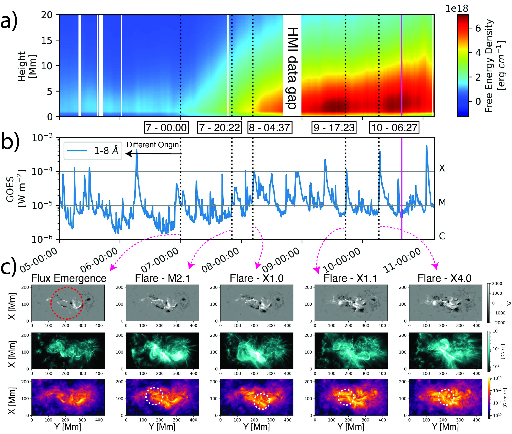

# AR 13664

On 2024 May 10/11, the strongest geomagnetic storm since November 2003 has occurred,
with a peak Dst index of $-412$~nT. The storm was caused by NOAA Active Region (AR) 13664,
which was the source of a large number of fast coronal mass ejections (CMEs) and big flares,
including 12 X-class flares.

We perform 3D magnetic field extrapolations with the **NF2** nonlinear-force free code based on physics
informed neural networks.
This tutorial provides an overview on how to access the derived data products and how to load snapshots for further
analysis.

**This page is currently under construction**
**The publication is currently under review**

## Overview

Overview of the evolution of NOAA AR 13664 from 2024 May 5-00:00 to 11-04:36 UT. a) Evolution of the vertical
distribution of free magnetic energy. b)
GOES 1-8~{\AA} soft X-ray flux. c) Observed SDO/HMI radial magnetic field maps, SDO/AIA~131~{\AA} EUV maps, and the
modeled current density integrated along the vertical axis. We show the initial flux emergence (snapshot at 2024 May 7
00:00~UT) and the major flare eruptions (indicated by dashed lines). The magenta line indicates the point where the
right edge of the SHARP reaches 60$^\circ$ longitude, beyond which the reliability of the vector magnetograms and the
modeled coronal field decreases. The circles in the integrated current density maps indicate points of flux domain
interactions. An animation of the full time series is available in the online journal. Left top: B$_z$ of the modeled
photospheric magnetic field. Right top: EUV observations from SDO/AIA~131~{\AA} EUV. Left bottom: maps of integrated
current density. Right bottom: maps of integrated free magnetic energy. The sequence shows the re-configuration of
magnetic domains (dark lines in current density maps) during strong solar eruptions.

## Data archive

All data products are publicly available through [Globus](https://app.globus.org/file-manager?origin_id=4263de78-cfdb-401e-a62b-dae3b935530a&origin_path=%2F) website.

## Load hdf5 snapshot

**in progress**

## Load NF2 snapshot

**in progress**

## Load evaluation results

**in progress**

## Publication

**in progress**